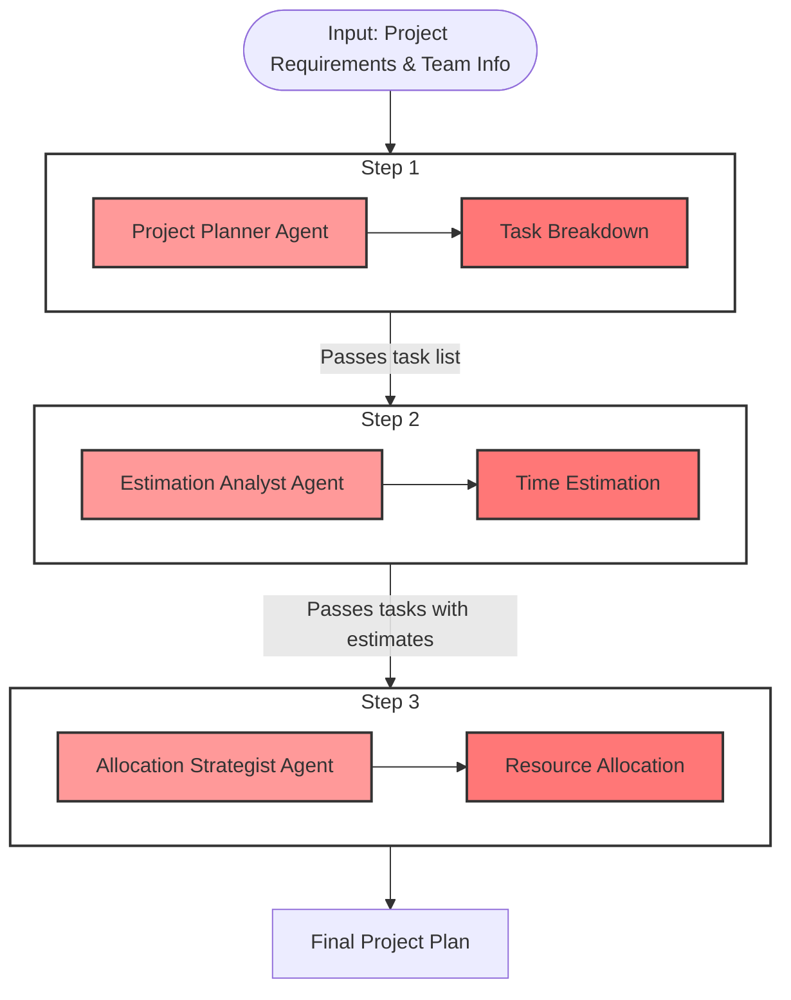

# Explain crew workflow



Let's look at how this data passing happens in the code. The key is in the Crew setup and Task configurations.

First, in the `L_1.ipynb` file, we create the tasks and link them to agents:

```python
# Creating Tasks
task_breakdown = Task(
  config=tasks_config['task_breakdown'],
  agent=project_planning_agent
)

time_resource_estimation = Task(
  config=tasks_config['time_resource_estimation'],
  agent=estimation_agent
)

resource_allocation = Task(
  config=tasks_config['resource_allocation'],
  agent=resource_allocation_agent,
  output_pydantic=ProjectPlan # This defines the final output structure
)

# Creating Crew with sequential order
crew = Crew(
  agents=[
    project_planning_agent,
    estimation_agent,
    resource_allocation_agent
  ],
  tasks=[
    task_breakdown,
    time_resource_estimation,
    resource_allocation
  ],
  verbose=True
)
```

The task descriptions in `tasks.yaml` show how each task uses the output from the previous task:

```yaml
# First task - Task Breakdown
task_breakdown:
  description: >
    Carefully analyze the project_requirements for the {project_type}
    project and break them down into individual tasks...

# Second task - Takes output from task breakdown
time_resource_estimation:
  description: >
    Thoroughly evaluate each task in the {project_type} project to
    estimate the time, resources, and effort required...

# Third task - Takes output from time estimation
resource_allocation:
  description: >
    Strategically allocate tasks for the {project_type} project to
    team members based on their skills...
```

The actual passing of data between tasks happens internally in CrewAI when you call:

```python
result = crew.kickoff(
  inputs=inputs
)
```

CrewAI handles the sequential execution and passing of data between tasks behind the scenes. Each agent's response becomes part of the context for the next agent's task, though this isn't explicitly visible in the code.

Looking at the output structure (which we saw in the notebook), we can see how each step built upon the previous one:
1. First agent created the task list
2. Second agent added time estimates
3. Final agent added resource allocations

So while the data passing isn't explicitly coded by us, CrewAI's `Crew` class manages this sequential flow internally, ensuring each agent has access to the previous agent's output. This is part of CrewAI's core functionality that makes it work as a pipeline.

## Project Requirements and Team Info

Project Requirements and Team info are defined in the cell below `Crew's Inputs`

```python
from IPython.display import display, Markdown

project = 'Website'
industry = 'Technology'
project_objectives = 'Create a website for a small business'
team_members = """
- John Doe (Project Manager)
- Jane Doe (Software Engineer)
- Bob Smith (Designer)
- Alice Johnson (QA Engineer)
- Tom Brown (QA Engineer)
"""
project_requirements = """
- Create a responsive design that works well on desktop and mobile devices
- Implement a modern, visually appealing user interface with a clean look
- Develop a user-friendly navigation system with intuitive menu structure
- Include an "About Us" page highlighting the company's history and values
- Design a "Services" page showcasing the business's offerings with descriptions
- Create a "Contact Us" page with a form and integrated map for communication
- Implement a blog section for sharing industry news and company updates
- Ensure fast loading times and optimize for search engines (SEO)
- Integrate social media links and sharing capabilities
- Include a testimonials section to showcase customer feedback and build trust
"""
```